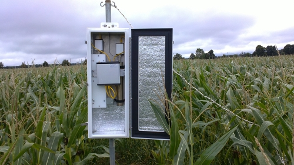

.. cosmicsense documentation master file, created by
   sphinx-quickstart on Tue Feb 19 13:12:20 2019.
   You can adapt this file completely to your liking, but it should at least
   contain the root `toctree` directive.

===============
``cosmicsense``
===============
--------------------------------------------------------
From Cosmic Ray Neutron Counts to Soil Moisture Products
--------------------------------------------------------

These pages provide documentation of the ``cosmicsense`` package which is
being developed as part of the CosmicSense Research Group funded by the German
Research Foundation (Deutsche Forschungsgemeinschaft, DFG).

The ``cosmicsense`` package provides a platform to collect algorithms and
workflows to estimate soil moisture from cosmic ray neutron counters, and
compare such estimates with other soil moisture products.

 .. toctree::
    :maxdepth: 2
    :caption: Contents:

    gettingstarted
    reference

Indices and tables
==================

* :ref:`genindex`
* :ref:`modindex`
* :ref:`search`
